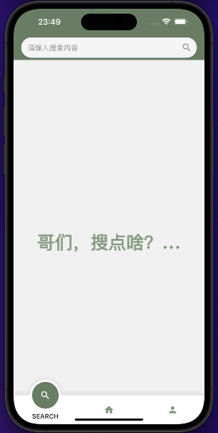
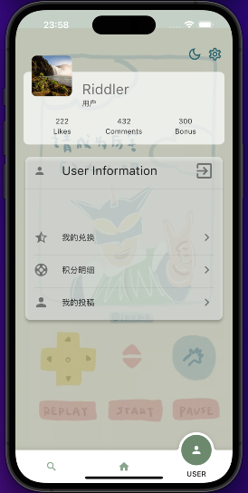
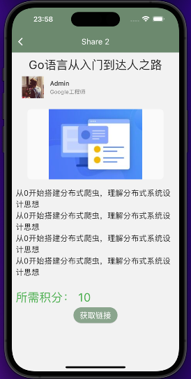
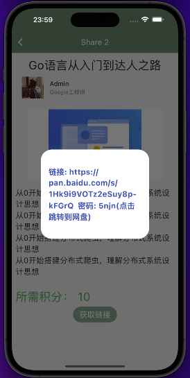
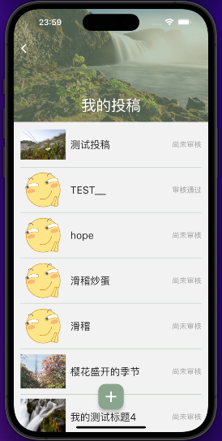
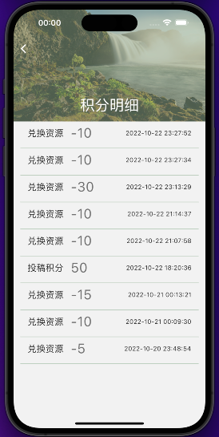
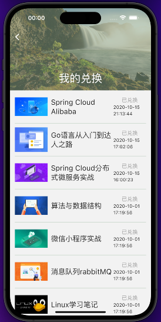
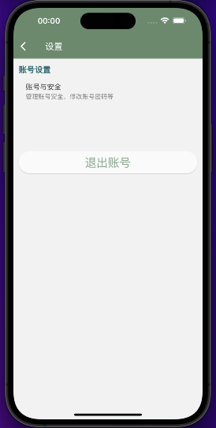
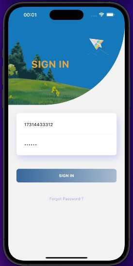

# share_app

|                           |  |  |  |
| ------------------------------------------------------------ | ------------------------------------------------------------ | ------------------------------------------------------------ | ------------------------------------------------------------ |
|  |  |  |  |
|  |  |  |  |

- [后端微服务项目](https://github.com/wardendon/share-micro-project)
- 路由白名单（首页、搜索、我的、设置）
- 登录：账号密码登录
- 首页：轮播图、公告、分享列表
- 搜索：支持模糊查询
- 我的：用户资料、
  - 我的兑换
  - 积分明细
  - 我的投稿
  - 资料编辑（改头像、昵称）
  - 设置（改密码、退出登录）
- 分享详情页：点击【获取链接】按钮发送兑换请求，请求成功后刷新用户积分状态，弹出对话框，显示链接和密码，点击链接跳转，请求失败则弹出SnackBar提示积分不足。管理员可在详情页之间看到链接和密码。
- 审核：管理员见入口
